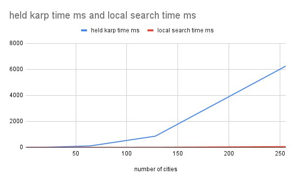
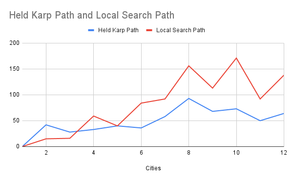

# Traveling Salesperson Problem -- Empirical Analysis

For this exercise, you'll need to take the code from the TSP Held-Karp and TSP
Local Search exercises. This can be your own implementation or somebody else's.
You will now do an empirical analysis of the implementations, comparing their
performance. Both the Held-Karp and the Local Search algorithms solve the same
problem, but they do so in completely different ways. This results in different
solutions, and in different times required to get to the solution.

Investigate the implementations' empirical time complexity, i.e. how the runtime
increases as the input size increases. *Measure* this time by running the code
instead of reasoning from the asymptotic complexity (this is the empirical
part). Create inputs of different sizes and plot how the runtime scales (input
size on the $x$ axis, time on the $y$ axis). Your largest input should have a
runtime of *at least* an hour. The input size that gets you to an hour will
probably not be the same for the Held-Karp and Local Search implementations.

In addition to the measured runtime, plot the tour lengths obtained by both
implementations on the same input distance matrices. The length of the tour that
Held-Karp found should always be less than or equal to the tour length that
Local Search found. Why is this?

Add the code to run your experiments, graphs, and an explanation of what you did
to this markdown file.

### Analysis

I made a program `test.js` that will test the two programs with increasing by powers of 2 input sizes. The inputs are randomly generated. Then the data is saved to a csv file. My program crashed for inputs bigger than 1000, which meant I couldn't get a run time of an hour yet.

The held karp programs appears to grow exponentially while it's hard see the local search line, it grows in a linear fashion. One thing to note is that for larger inputs it's sometimes faster than the smaller input, due to the random factor. 

In this graph you can see they both grow linearly, however as things get bigger the local search path cost gets larger than the held karp path. It's always greater or less than the held karp path because hk finds the best path. While local search does the best path within the iteration limit. This becomes farther from the best path as the input size grows because in my implementation the iteration limit does not scale at the same rate as n!.

I certify that I have listed all sources used to complete this exercise, including the use of any Large Language Models. All of the work is my own, except where stated otherwise. I am aware that plagiarism carries severe penalties and that if plagiarism is suspected, charges may be filed against me without prior notice.

