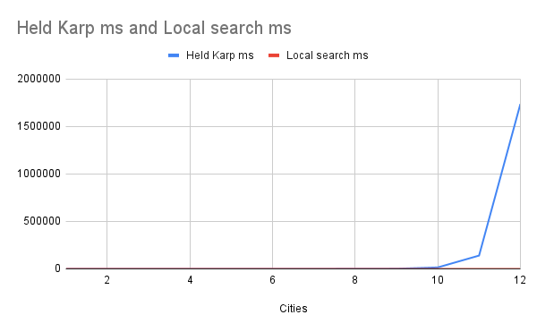

# Traveling Salesperson Problem -- Empirical Analysis

For this exercise, you'll need to take the code from the TSP Held-Karp and TSP
Local Search exercises. This can be your own implementation or somebody else's.
You will now do an empirical analysis of the implementations, comparing their
performance. Both the Held-Karp and the Local Search algorithms solve the same
problem, but they do so in completely different ways. This results in different
solutions, and in different times required to get to the solution.

Investigate the implementations' empirical time complexity, i.e. how the runtime
increases as the input size increases. *Measure* this time by running the code
instead of reasoning from the asymptotic complexity (this is the empirical
part). Create inputs of different sizes and plot how the runtime scales (input
size on the $x$ axis, time on the $y$ axis). Your largest input should have a
runtime of *at least* an hour. The input size that gets you to an hour will
probably not be the same for the Held-Karp and Local Search implementations.

In addition to the measured runtime, plot the tour lengths obtained by both
implementations on the same input distance matrices. The length of the tour that
Held-Karp found should always be less than or equal to the tour length that
Local Search found. Why is this?

Add the code to run your experiments, graphs, and an explanation of what you did
to this markdown file.

### Analysis

I made a program `test.js` that will test the two programs with increasing by powers of 2 input sizes. The inputs are randomly generated. Then the data is saved to a csv file. I had issues with my previous implementation of held karp so I am using another students code who is linked below. The times have gone up for held karp suggesting that the previous version I wrote here was not finding the optimal path. This one is finding the optimal path I believe, I only got up to 28 min because I was busy with exams most of the day and didn't think to try someone else's code until late tonight. However, I estimate that an input size of 13 will be over an hour as I have been waiting for about 47 min now.

The held karp programs appears to grow exponentially while it's hard see the local search line, it grows in a linear fashion. One thing to note is that for larger inputs it's sometimes faster than the smaller input, due to the random factor. After 10 cities the difference is rather stark and gets higher from there.

In this graph you can see they both grow linearly, however as things get bigger the local search path cost gets larger than the held karp path. It certainly should always be greater than or equal held karp since hk finds the very optimal solution while local search approximates it. I assume there is an issue in my local search code causing an error which is why it is giving a distance that is smaller than the one given by hk for inputs smaller than 4. I've tested this and it is always for inputs less than 4 that my local search code gives me paths that are smaller than held karp so I assume that my code has a bug in it. However, for inputs larger than 4 you can see that it is larger than held karp and grows at a faster rate. This is due to the fact that the way my code chooses how long to iterate grows at a slower rate than the complexity of the tsp problem.

Source of Held-Karp code: https://github.com/COSC3020/tsp-held-karp-noahcanen/blob/main/code.js

I certify that I have listed all sources used to complete this exercise, including the use of any Large Language Models. All of the work is my own, except where stated otherwise. I am aware that plagiarism carries severe penalties and that if plagiarism is suspected, charges may be filed against me without prior notice.

